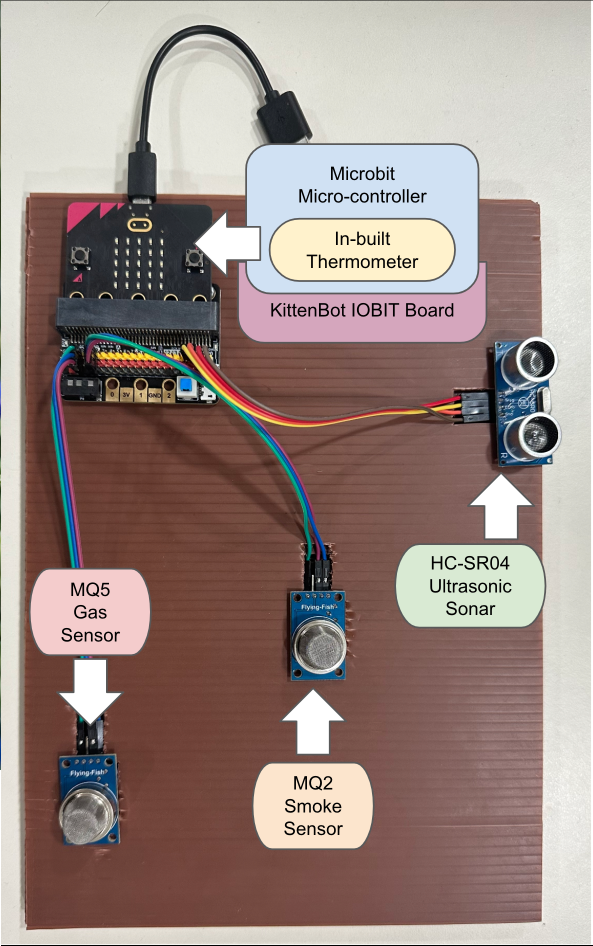
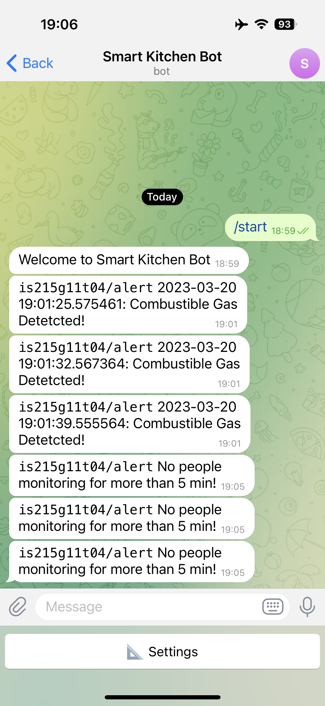
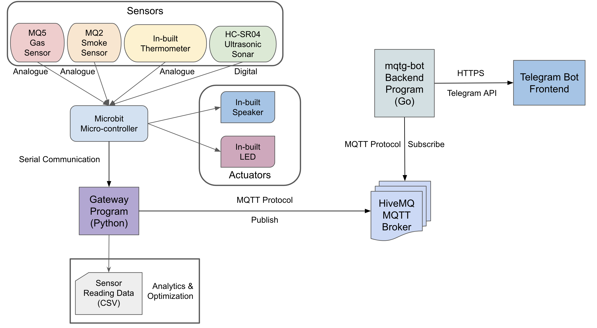

<div id="top"></div>
<!--
*** Template from: https://github.com/othneildrew/Best-README-Template
*** Thanks for checking out the Best-README-Template. If you have a suggestion
*** that would make this better, please fork the repo and create a pull request
*** or simply open an issue with the tag "enhancement".
*** Don't forget to give the project a star!
*** Thanks again! Now go create something AMAZING! :D
-->

<!-- PROJECT LOGO -->
<br />
<!-- <div align="center">
  <a href="https://github.com/MarkMa512/smart-hostel">
    
  </a> -->

<h3 align="center">Smart Kitchen Management System</h3>

  <p align="center">
    a IS215 Digital Business Technologies and Transformation Project
    <br />
    <a href="https://github.com/MarkMa512/smart-hostel"><strong>Explore the docs »</strong></a>
    <br />
    <br />
    <a href="https://youtu.be/VCjBWMjaBcI">View Video Demo</a>
    ·
    <a href="https://github.com/MarkMa512/smart-hostel/issues">Report Bug</a>
    ·
    <a href="https://github.com/MarkMa512/smart-hostel/issues">Request Feature</a>
  </p>
</div>

<!-- TABLE OF CONTENTS -->
<details>
  <summary>Table of Contents</summary>
  <ol>
    <li>
      <a href="#about-the-project">About The Project</a>
      <ul>
        <li><a href="#dashboard-screenshot">Dashboard Screenshoot</a></li>
        <li><a href="#video-demo">Video Demo</a></li>
        <li><a href="#built-with">Built With</a></li>
        <li><a href="#directories">Directories</a></li>
        <li><a href="#architectural-diagram">Architectural Diagram</a></li>
      </ul>
    </li>
    <li>
      <a href="#getting-started">Getting Started</a>
      <ul>
        <li><a href="#prerequisites">Prerequisites</a></li>
        <li><a href="#sensors-and-device-configuration">Sensors and device configuration</a></li>
        <li><a href="#installation">Installation</a></li>
      </ul>
    </li>
    <li><a href="#roadmap">Roadmap</a></li>
    <li><a href="#acknowledgments">Acknowledgments</a></li>
  </ol>
</details>


<!-- ABOUT THE PROJECT -->
## About The Project

### Setup and Screenshoot


|  |  |


### Video Demo
<!-- [](https://www.youtube.com/watch?v=VCjBWMjaBcI) -->


### Built With
* [Micro:bits](https://microbit.org/)
* [Python](https://www.python.org)
* [Go](https://go.dev)
* [MQTT Client Telegram Bot](https://github.com/xDWart/mqtg-bot)


<p align="right">(<a href="#top">back to top</a>)</p>

### Directories
- [`/gateway`](https://github.com/MarkMa512/smart-hostel/tree/master/sensor_and_gateway): gateway porgam

- [`/media`](https://github.com/MarkMa512/smart-hostel/tree/master/media): photos of models, setup and illustrations

- [`/microbit`](): program for microbit micro-controller

- [`/mqtg-bot`](https://github.com/MarkMa512/smart-hostel/tree/master/front_end): mqtg-bot backend program, forked from: [MQTT Client Telegram Bot](https://github.com/xDWart/mqtg-bot)


### Architectural Diagram




<!-- GETTING STARTED -->
## Getting Started

### Prerequisites
1. Ensure [Python 3.9](https://www.python.org/downloads/) or higher is installed; Ensure [pip](https://pip.pypa.io/en/stable/installation/) is installed. 
2. Ensure [go1.20.2](https://go.dev/doc/install) or higher is installed

### Sensors and device information and configuration
1. microbit and sensors setup 
- Micro-controller: [Micro:bit V2](https://microbit.org/new-microbit/)
- Micro-controller Program: [`/microbit/microbit.py`](https://github.com/MarkMa512/smart-hostel/blob/master/microbit/microbit.py) 
- Extension board: [KittenBot IOBIT V2.0 for micro:bit](https://www.kittenbot.cc/products/kittenbot-iobit-v2-0-for-microbit) 
- Sensors configuration: 
  - [MQ5 Gas Sensor](https://wiki.seeedstudio.com/Grove-Gas_Sensor-MQ5/)
    - AO: Pin0 S
    - DO: Empty
    - GND: G
    - VCC: 3V
  - [MQ2 Gas/Smoke Sensor](https://wiki.seeedstudio.com/Grove-Gas_Sensor-MQ2/)
    - AO: Pin2 S
    - DO: Empty
    - GND: G
    - VCC: 3V
  - [HC-SR-04 Ultrasonic Distance Sensor](https://randomnerdtutorials.com/complete-guide-for-ultrasonic-sensor-hc-sr04/)
    - Vcc: 3V
    - Trig: Pin15 S
    - Echo: Pin16 S
    - Gnd: G

2. micrboit program  
  a. connect the Microbit to your machine via USB port.  
  b. visit: [micro:bit Python Editor](https://python.microbit.org/v/3)  
  c. copy the content from [`/microbit/microbit.py`](https://github.com/MarkMa512/smart-hostel/blob/master/microbit/microbit.py) to the editor  
  d. click `Send to micro:bit` button to flash the program to the microbit.  

### Installation

1. Clone the repo onto the respective machines
   ```sh
    git clone --recursive https://github.com/MarkMa512/smart-hostel.git
   ```
2. Setup the Microbits according to <a href="#sensors-and-device-configuration">Sensors and device configuration</a>

3. Gateway Machine: Using terminal (macOS) or Command Prompt (Windows)  
  - Enter `gateway` directory:  
    ```sh 
    cd gateway
    ```
  - Install the dependencies 
    ```sh
    pip install -r requirement.txt
    ```
  - run `gateway.py`:  
    ```sh
    python3 gateway.py
    ```
    or 
    ```sh
    python gateway.py
    ```

4. Back-end Machine and Telegram Bot Setup: Please refer to [`mqtg-bot/README.md`](https://github.com/MarkMa512/smart-hostel/tree/master/back_end#readme)

<p align="right">(<a href="#top">back to top</a>)</p>


<!-- ROADMAP -->
## Roadmap
- [x] Event 1: Temperature exceeded TEMPERATURE_THRESHOLD 
  - Temperature readings are read from Microbit's inbuilt thermometer, and the reading has been passed to the [`/gateway/gateway.py`]() through serial communication. If the temperature has exceed the `TEMPERATURE_THRESHOLD` defined in the `alert_filter()` function, a high temperature alert will be sent off from the gateway program to the MQTT broker. 
  - Scenario: 
    - Fridge temperature monitoring 
    - Oven/Stove surrouding temperature monitoring

- [x] Event 2: Combustible gas leakage
  - Voltage readings are read off from the MQ5 sensor. When there is presence of combustible gases such as LPG and Natural Gas, the voltage will increase to above `GAS_THRESHOLD` defined in the [`/microbit/microbit.py`](), changing `gas_status` from 0 to 1. This will trigger the alarm and the display light on Microbit. This change will be detected by [`/gateway/gateway.py`]() via `alert_filter()` function, and an alart will be sent out to the MQTT broker. 
  - Scenario: 
    - Gas stove monitoring
    - Food storage monitoring (by changing gas sensor to MQ135 Air Quality Sensor)

- [x] Event 3: Smoke detected
  - Voltage readings are read off from the MQ2 sensor. When there is presence of smoke, the voltage will increase to above `SMOKE_THRESHOLD` defined in the [`/microbit/microbit.py`](), changing `smoke_status` from 0 to 1. This will trigger the alarm and the display light on Microbit. This change will be detected by [`/gateway/gateway.py`]() via `alert_filter()` function, and an alart will be sent out to the MQTT broker. 
  - Scenario: 
    - Fire and smoke detection

- [x] Event 4: Unguarded stove / no motion detected
    - Distance reading are read off from the HC-SR-04 Ultrasonic Distance Sensor. When there are motions, the distance reading fluctuates, and the timing are recorded as `last_motion_time`. When there is no motion detetced for more than `TIME_THRESHOLD` defined in the `sonar_motion_filter()` function in [`/gateway/gateway.py`](), an alarm will be send out to the MQTT broker. 
    - Scenario: 
      - Ensuring critial locations are guarded by person
      - Detect the presence of person / object


<p align="right">(<a href="#top">back to top</a>)</p>


<!-- ACKNOWLEDGMENTS -->
## Acknowledgments
- A special thank to [Kunyah Cafe](https://www.fortitudeculina.org/) for supporting us with the project. 
- A special thank to [MQTT Client Telegram Bot](https://github.com/xDWart/mqtg-bot) for the backend go client program. 

<p align="right">(<a href="#top">back to top</a>)</p>